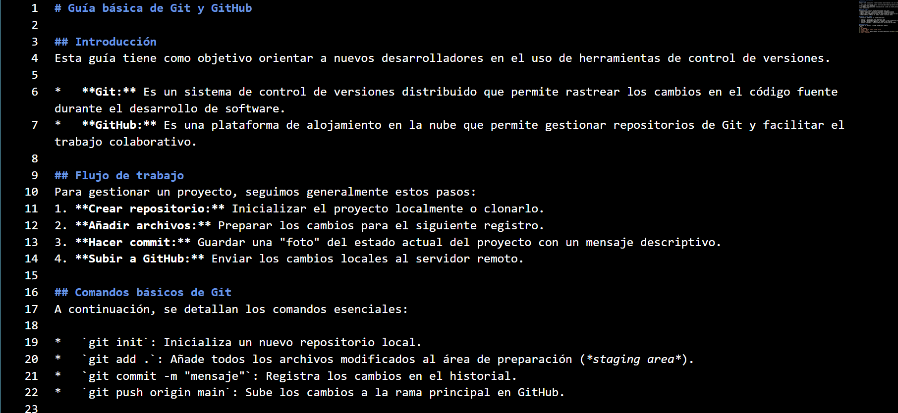
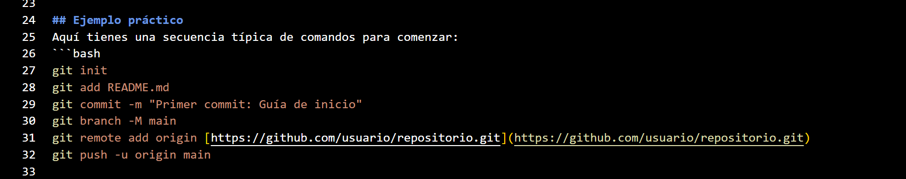

# Guía básica de Git y GitHub


## Introducción
Esta guía tiene como objetivo orientar a nuevos desarrolladores en el uso de herramientas de control de versiones.

*   **Git:** Es un sistema de control de versiones distribuido que permite rastrear los cambios en el código fuente durante el desarrollo de software.
*   **GitHub:** Es una plataforma de alojamiento en la nube que permite gestionar repositorios de Git y facilitar el trabajo colaborativo.

## Flujo de trabajo
Para gestionar un proyecto, seguimos generalmente estos pasos:
1. **Crear repositorio:** Inicializar el proyecto localmente o clonarlo.
2. **Añadir archivos:** Preparar los cambios para el siguiente registro.
3. **Hacer commit:** Guardar una "foto" del estado actual del proyecto con un mensaje descriptivo.
4. **Subir a GitHub:** Enviar los cambios locales al servidor remoto.

### Ejemplo del archivo en markdown
# 📸👇👇👇



## Comandos básicos de Git
A continuación, se detallan los comandos esenciales:

*   `git init`: Inicializa un nuevo repositorio local.
*   `git add .`: Añade todos los archivos modificados al área de preparación (*staging area*).
*   `git commit -m "mensaje"`: Registra los cambios en el historial.
*   `git push origin main`: Sube los cambios a la rama principal en GitHub.


## Ejemplo práctico
Aquí tienes una secuencia típica de comandos para comenzar:
```bash
git init
git status
git add .
git add README.md
git commit -m "Primer commit: Guía de inicio"
git branch -M main
git remote add origin [https://github.com/usuario/repositorio.git]
git push -u origin main

```
Pero puedes mostrar que eres un experto en Git y GitHub con comandos más avanzados como:
```bash
git checkout -b nueva-rama
git merge main  
git commit feat: "Agregar nueva funcionalidad"
git commit fix: "Corregir error en función X"

```
### Ejemplo del archivo en markdown
# 📸👇👇👇




## Errores comunes

*   Olvidar el git add: Si no añades el archivo, el commit estará vacío.

*   Mensajes de commit poco claros: Usa mensajes descriptivos como "Corregir error en login" en lugar de "Cosas".

*   Trabajar en la rama incorrecta: Verifica siempre en qué rama estás con git branch antes de hacer cambios.
